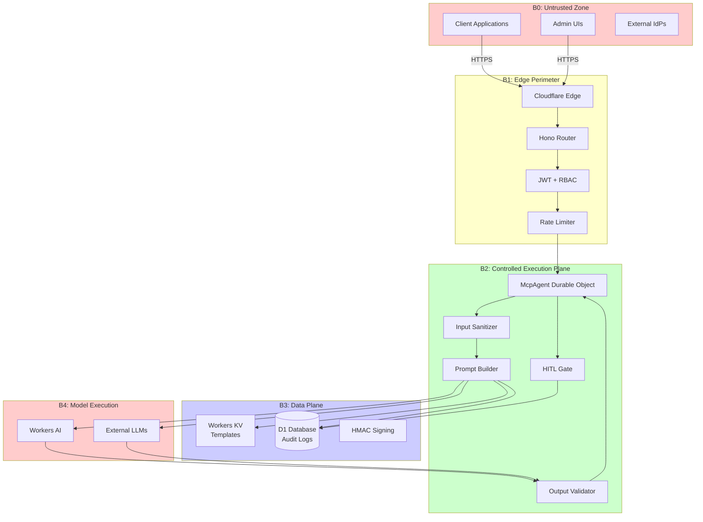

# promptcrafting-mcp

Security-hardened prompt engineering framework deployed as an MCP server on Cloudflare Workers.

## Architecture

### Overview

The system implements a defense-in-depth architecture with five security boundaries (B0–B4). Each boundary has specific threat mitigations following the STRIDE model. For detailed threat analysis, see [docs/threat-model/README.md](docs/threat-model/README.md).



### Security Boundaries

| Boundary | Zone | Purpose | Key Controls |
|----------|------|---------|--------------|
| **B0** | Untrusted Zone | Internet-facing clients | TLS, DDoS protection |
| **B1** | Edge Perimeter | Authentication & rate limiting | JWT (HS256), RBAC, identity-based rate limits |
| **B2** | Execution Plane | Prompt processing & guardrails | Input sanitization, sandwich defense, HITL gate, output validation |
| **B3** | Data Plane | Storage & audit | HMAC signing, immutable logs, versioning |
| **B4** | Model Execution | AI inference (untrusted) | Treat all outputs as untrusted, validate on return |

## Four-Layer Prompt Stack

Every prompt is compiled from four structured layers:

| Layer | Purpose | Security Role |
|-------|---------|---------------|
| **Objective** | Task definition + success criteria | Defines allowed scope |
| **Role** | Persona + domain context | Shifts model vocabulary |
| **Constraints** | Boundaries + forbidden actions | Security policy enforcement |
| **Output Shape** | Format + schema + examples | Enables Zod validation |

## Quick Start

### Prerequisites

- Node.js 18+ and npm
- A Cloudflare account with Workers paid plan (for Durable Objects)
- Wrangler CLI (installed with `npm install`)

### Deployment Steps

```bash
# 1. Clone and install dependencies
git clone https://github.com/canstralian/promptcrafting-mcp.git
cd promptcrafting-mcp
npm install

# 2. Create Cloudflare resources
wrangler kv namespace create PROMPT_TEMPLATES
wrangler kv namespace create PROMPT_TEMPLATES --preview
wrangler d1 create promptcrafting-audit

# 3. Update wrangler.jsonc with the IDs returned from step 2
#    Replace the placeholder IDs in the kv_namespaces and d1_databases sections

# 4. Set required secrets
# JWT_SECRET: Used for JWT signing (HS256). Generate with: openssl rand -base64 32
wrangler secret put JWT_SECRET
# TEMPLATE_HMAC_KEY: Used for template content signing. Generate with: openssl rand -base64 32
wrangler secret put TEMPLATE_HMAC_KEY

# 5. Run database migrations
npm run db:migrate

# 6. Deploy to Cloudflare Workers
npm run deploy
```

### Local Development

```bash
# Run local development server with hot reload
npm run dev

# Run local migrations (uses --local flag)
npm run db:migrate:local

# Type check
npm run check

# Run tests
npm test

# Lint code
npm run lint
```

### Required Secrets

| Secret | Purpose | Generation Command |
|--------|---------|-------------------|
| `JWT_SECRET` | JWT token signing (HS256) | `openssl rand -base64 32` |
| `TEMPLATE_HMAC_KEY` | Template integrity signing | `openssl rand -base64 32` |

### Optional Configuration

Set these via `wrangler secret put` or environment variables in `wrangler.jsonc`:

- `OPENAI_API_KEY` - For external OpenAI model support (optional)
- `ENVIRONMENT` - Deployment environment (default: "production")
- `LOG_LEVEL` - Logging verbosity (default: "info")
- `HITL_TIMEOUT_MS` - HITL approval timeout in milliseconds (default: "300000")
- `MAX_PROMPT_LENGTH` - Maximum input length (default: "50000")

## Security Controls

This system implements comprehensive security controls across all five boundaries. For detailed threat analysis and STRIDE coverage, see [docs/threat-model/README.md](docs/threat-model/README.md). For TLS/transport security policy, see [docs/security/tls-policy.md](docs/security/tls-policy.md).

### Control Summary by Boundary

| Boundary | Threat | Mitigation | Status |
|----------|--------|------------|--------|
| B0→B1 | Spoofing | JWT with algorithm pinning (HS256 only) | ✅ |
| B0→B1 | DoS | Identity-keyed rate limiting (not IP) | ✅ |
| B1→B2 | Privilege escalation | RBAC with permission checks | ✅ |
| B2 | Direct prompt injection | NFKC + regex + entropy analysis | ✅ |
| B2 | Indirect injection | Structured separation + sandwich defense | ✅ |
| B2 | Token smuggling | Invisible char stripping + normalization | ✅ |
| B3 | Template poisoning | HMAC-SHA256 content signing | ✅ |
| B3 | Repudiation | Immutable D1 audit logs | ✅ |
| B4 | Prompt extraction | Canary tokens in system prompt | ✅ |
| B4→B2 | Schema drift | Zod fail-closed output validation | ✅ |
| B4→B2 | PII leakage | Regex PII detection + redaction | ✅ |
| B4→B2 | Prompt leakage | System instruction pattern detection | ✅ |
| B1 | JWT confusion | Algorithm pinning, claim validation | ✅ |
| B2 | HITL bypass | Fail-closed gate with dead-letter timeout | ✅ |

### Key Security Features

- **Fail-Closed by Default**: All guardrails block on failure
- **Zero Outbound Fetches**: All external communication via Cloudflare native bindings (no TLS attack surface)
- **Immutable Audit Trail**: D1 logs with content hashes for forensic analysis
- **HITL Gate**: Human approval required for sensitive prompts (SPEC KIT A3 compliance)
- **Template Integrity**: HMAC-SHA256 signing prevents tampering
- **Defense in Depth**: Multiple layers of validation at each boundary

For implementation details and residual risks, see the [full threat model documentation](docs/threat-model/README.md).

## Endpoints

| Path | Method | Auth | Description |
|------|--------|------|-------------|
| `/health` | GET | No | Health check |
| `/mcp/*` | ALL | JWT | MCP protocol (Streamable HTTP) |
| `/api/v1/templates` | GET | JWT + `template:read` | List templates |
| `/api/v1/templates/:id` | GET | JWT + `template:read` | Get template |
| `/api/v1/templates/:id` | DELETE | JWT + `template:delete` | Delete template |
| `/api/v1/audit` | GET | JWT + `audit:read` | Query audit logs |

## MCP Tools

The server exposes 11 MCP tools organized into four categories. All tools enforce authentication, RBAC permissions, and audit logging.

### Template Management (5 tools)

#### 1. `promptcraft_create_template`

Create a new four-layer prompt template with HMAC-signed content integrity.

**Input Schema:**
```typescript
{
  name: string;           // 3-100 chars, human-readable
  description?: string;   // Optional, max 500 chars
  objective: string;      // Layer 1: Task definition, 10-5000 chars
  role: string;           // Layer 2: Persona and context, 10-5000 chars
  constraints?: string;   // Layer 3: Boundaries, max 5000 chars (default: safety guidelines)
  outputShape?: string;   // Layer 4: Format schema, max 5000 chars (default: plain text)
  tags?: string[];        // Max 20 tags, each max 50 chars
  model?: string;         // Target model hint (e.g., @cf/meta/llama-4-scout-17b-16e-instruct)
  requiresHITL?: boolean; // If true, all executions require human approval (default: false)
}
```

**Output:**
```typescript
{
  id: string;           // UUID
  name: string;
  version: number;      // Always 1 for new templates
  contentHash: string;  // SHA-256 hash
  requiresHITL: boolean;
  created: true;
}
```

**Annotations:** write, non-destructive, non-idempotent

---

#### 2. `promptcraft_get_template`

Retrieve a template with HMAC integrity verification.

**Input Schema:**
```typescript
{
  templateId: string;    // UUID
  version?: number;      // Optional: fetch specific version, omit for latest
}
```

**Output:** Full `PromptTemplate` object with all layers and metadata

**Annotations:** read-only, idempotent

---

#### 3. `promptcraft_list_templates`

List available templates with pagination and tag filtering.

**Input Schema:**
```typescript
{
  tags?: string[];      // Filter by tags
  limit?: number;       // 1-100, default 20
  cursor?: string;      // KV pagination cursor
}
```

**Output:**
```typescript
{
  templates: Array<{
    id: string;
    name: string;
    version: number;
  }>;
  count: number;
  cursor: string | null;
  hasMore: boolean;
}
```

**Annotations:** read-only, idempotent

---

#### 4. `promptcraft_update_template`

Update template layers with version increment and re-signing.

**Input Schema:**
```typescript
{
  templateId: string;      // UUID
  objective?: string;      // Update Layer 1
  role?: string;           // Update Layer 2
  constraints?: string;    // Update Layer 3
  outputShape?: string;    // Update Layer 4
  description?: string;    // Update description
  tags?: string[];         // Update tags
  model?: string;          // Update model hint
  requiresHITL?: boolean;  // Enable/disable HITL gate
}
```

**Output:**
```typescript
{
  id: string;
  name: string;
  version: number;         // Incremented
  contentHash: string;     // Recomputed
  requiresHITL: boolean;
  updated: true;
}
```

**Annotations:** write, non-destructive, non-idempotent

---

#### 5. `promptcraft_delete_template`

Soft-delete a template (versioned copies retained for audit).

**Input Schema:**
```typescript
{
  templateId: string;      // UUID
}
```

**Output:**
```typescript
{
  deleted: true;
  id: string;
  version: number;
  hmacValidAtDeletion: boolean;
  note: string;
}
```

**Annotations:** write, destructive, non-idempotent (rejects double-delete)

---

### Execution & Validation (2 tools)

#### 6. `promptcraft_execute_prompt`

Execute a template through the full security pipeline with HITL gate support.

**Pipeline Steps:**
1. Load template with HMAC verification
2. **HITL Gate**: If `requiresHITL` is true, block until human approves/rejects (timeout routes to dead-letter)
3. Sanitize user input (NFKC, injection detection)
4. Compile four-layer prompt with structured separation
5. Run inference via Workers AI
6. Validate output (schema, PII, leakage, canary)
7. Log to audit trail

**Input Schema:**
```typescript
{
  templateId: string;         // UUID
  templateVersion?: number;   // Optional: specific version
  userInput?: string;         // User data (treated as DATA, not instructions), max 50000 chars
  variables?: Record<string, string>; // Template variable substitutions (each max 10000 chars)
  model?: string;             // Override target model
  sandwichDefense?: boolean;  // Apply post-input reinforcement (default: true)
  maxTokens?: number;         // 1-16384, default 4096
  outputSchema?: string;      // JSON Schema for validation (fail-closed)
}
```

**Output:**
```typescript
{
  requestId: string;         // UUID for audit trail lookup
  output: string;            // Model response (sanitized)
  model: string;             // Actual model used
  latencyMs: number;
  guardrails: {
    inputSanitized: boolean;
    injectionDetected: boolean;
    outputSchemaValid: boolean;
    piiDetected: boolean;
    piiRedacted: boolean;
    canaryTokenPresent: boolean;
    leakageDetected: boolean;
  };
}
```

**Error Cases:**
- Template not found
- HMAC verification failed
- Input sanitization failed
- HITL rejected or timed out
- Inference error
- Output validation failed

**Annotations:** write, non-destructive, non-idempotent, open-world (calls external AI)

---

#### 7. `promptcraft_validate_input`

Dry-run validation without inference. Returns sanitization results and prompt preview.

**Input Schema:**
```typescript
{
  templateId: string;     // UUID
  userInput: string;      // Max 50000 chars
  variables?: Record<string, string>;
}
```

**Output:**
```typescript
{
  templateIntegrity: string;  // "verified" or "FAILED — possible tampering"
  requiresHITL: boolean;
  inputValidation: {
    pass: boolean;
    reason?: string;
  };
  threats: string[];            // Detected threat patterns
  promptPreview: {
    systemPromptLength: number;
    userPromptLength: number;
    systemPromptHash: string;   // SHA-256 (not exposed for security)
  };
}
```

**Annotations:** read-only, idempotent

---

### HITL Management (3 tools)

These tools require `hitl:resolve` permission (admin/operator roles only).

#### 8. `promptcraft_resolve_hitl`

Approve or reject a pending HITL execution request.

**Input Schema:**
```typescript
{
  requestId: string;              // UUID from execute_prompt
  resolution: "approved" | "rejected";
}
```

**Output:**
```typescript
{
  requestId: string;
  resolution: string;
  resolvedBy: string;             // User ID of approver
  resolvedAt: string;             // ISO 8601 timestamp
}
```

**Error Cases:**
- Request not found
- Already resolved (idempotency violation)
- Request expired

**Annotations:** write, non-destructive, non-idempotent

---

#### 9. `promptcraft_get_hitl_status`

Check HITL approval status by request ID.

**Input Schema:**
```typescript
{
  requestId: string;              // UUID
}
```

**Output:**
```typescript
{
  requestId: string;
  templateId: string;
  templateName: string;
  userId: string;                 // Requester
  status: "pending" | "approved" | "rejected" | "timed_out";
  createdAt: string;              // ISO 8601
  expiresAt: string;              // ISO 8601
  resolvedBy?: string;            // Approver user ID (if resolved)
  resolvedAt?: string;            // ISO 8601 (if resolved)
  variablesHash: string;          // SHA-256 of execution context
}
```

**Annotations:** read-only, idempotent

---

#### 10. `promptcraft_list_pending_hitl`

List all currently pending HITL approvals (excludes expired/resolved).

**Input Schema:**
```typescript
{
  limit?: number;                 // 1-100, default 50
}
```

**Output:**
```typescript
{
  pending: Array<{
    requestId: string;
    templateId: string;
    templateName: string;
    userId: string;
    createdAt: string;
    expiresAt: string;
    variablesHash: string;
  }>;
  count: number;
}
```

**Annotations:** read-only, idempotent

---

### Audit & Compliance (1 tool)

#### 11. `promptcraft_query_audit`

Query the execution audit trail with filtering.

**Input Schema:**
```typescript
{
  userId?: string;
  templateId?: string;              // UUID
  status?: "success" | "error" | "rate_limited" | "filtered" | "hitl_rejected" | "hitl_timeout";
  since?: string;                   // ISO 8601 datetime
  limit?: number;                   // 1-200, default 50
  offset?: number;                  // Default 0
}
```

**Output:**
```typescript
{
  logs: Array<{
    requestId: string;
    sessionId: string | null;
    templateId: string;
    templateVersion: number;
    userId: string;
    model: string;
    status: string;
    latencyMs: number;
    inputTokens: number;
    outputTokens: number;
    guardrailFlags: object;         // JSON object with guardrail verdicts
    createdAt: string;
  }>;
  count: number;
  hasMore: boolean;
}
```

**Annotations:** read-only, idempotent

---

### Permission Requirements

| Tool | Required Permission |
|------|---------------------|
| `promptcraft_create_template` | `template:write` |
| `promptcraft_get_template` | `template:read` |
| `promptcraft_list_templates` | `template:read` |
| `promptcraft_update_template` | `template:write` |
| `promptcraft_delete_template` | `template:delete` |
| `promptcraft_execute_prompt` | `prompt:execute` |
| `promptcraft_validate_input` | `prompt:execute` |
| `promptcraft_resolve_hitl` | `hitl:resolve` (admin/operator only) |
| `promptcraft_get_hitl_status` | `hitl:read` |
| `promptcraft_list_pending_hitl` | `hitl:read` |
| `promptcraft_query_audit` | `audit:read` |

## Project Structure

```
promptcrafting-mcp/
├── wrangler.jsonc            # Cloudflare config (all bindings)
├── package.json
├── tsconfig.json
├── CHANGELOG.md              # Version history
├── migrations/
│   ├── 0001_init.sql         # D1 schema (audit logs, template changes)
│   └── 0002_hitl.sql         # HITL approval tables
├── docs/
│   ├── threat-model/
│   │   └── README.md         # Full STRIDE analysis with Mermaid diagrams
│   └── security/
│       ├── tls-policy.md     # TLS/transport security policy
│       └── vulnerability-assessment.md
├── tests/
│   ├── integration/          # Full pipeline integration tests
│   ├── fixtures/             # Test templates and data
│   ├── setup/                # Test environment configuration
│   └── utils/                # Test helpers (HMAC, hash computation)
└── src/
    ├── index.ts              # Hono router (B1 perimeter)
    ├── mcp-agent.ts          # McpAgent Durable Object (B2)
    ├── types.ts              # Shared type definitions
    ├── schemas/
    │   └── index.ts          # Zod input schemas (11 tools)
    ├── middleware/
    │   └── auth.ts           # JWT, RBAC, rate limiting
    ├── guardrails/
    │   ├── index.ts          # Barrel export
    │   ├── input-sanitizer.ts  # NFKC, injection detection, separation, sandwich
    │   └── output-validator.ts # Schema, PII, leakage, canary
    ├── services/
    │   ├── prompt-builder.ts # Four-layer compiler, HMAC signing
    │   ├── audit.ts          # D1 audit trail operations
    │   └── hitl.ts           # HITL approval workflow (request, wait, resolve)
    └── tools/
        └── prompt-tools.ts   # MCP tool registrations (11 tools)
```

## Related Documentation

- **[CHANGELOG.md](CHANGELOG.md)** - Version history and release notes
- **[docs/threat-model/README.md](docs/threat-model/README.md)** - STRIDE threat analysis with Mermaid diagrams for all 5 boundaries
- **[docs/security/tls-policy.md](docs/security/tls-policy.md)** - TLS responsibility matrix and zero-fetch architecture
- **[tests/README.md](tests/README.md)** - Integration testing guide with MCP Inspector patterns

## License

This project is private and proprietary.

## Contributing

This is a private repository. Contributions require prior authorization.
