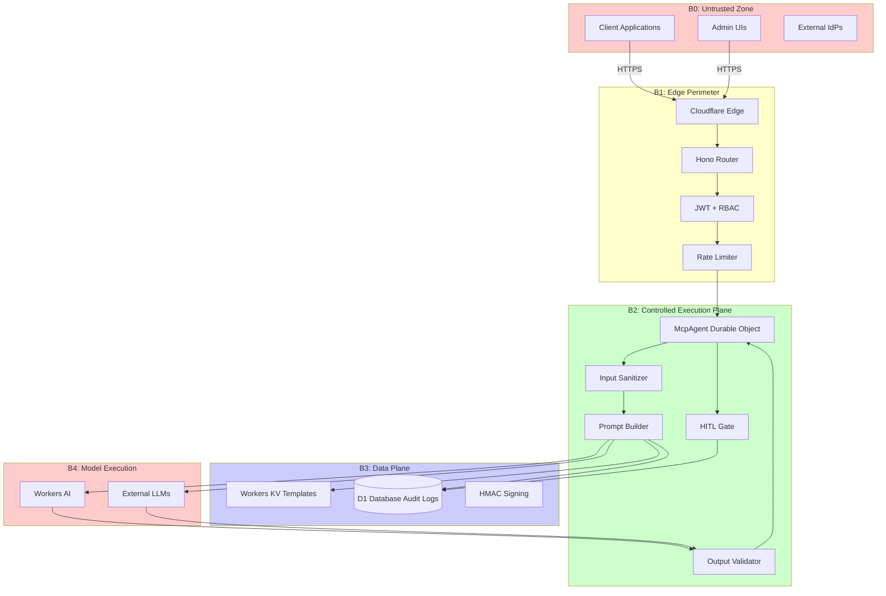

# promptcrafting-mcp

Security-hardened prompt engineering framework deployed as an MCP server on Cloudflare Workers.

## Architecture



For the full STRIDE threat model with per-boundary DFDs, see [`docs/threat-model/README.md`](docs/threat-model/README.md).

## Four-Layer Prompt Stack

Every prompt is compiled from four structured layers:

| Layer | Purpose | Security Role |
|-------|---------|---------------|
| **Objective** | Task definition + success criteria | Defines allowed scope |
| **Role** | Persona + domain context | Shifts model vocabulary |
| **Constraints** | Boundaries + forbidden actions | Security policy enforcement |
| **Output Shape** | Format + schema + examples | Enables Zod validation |

## Quick Start

```bash
# 1. Install dependencies
npm install

# 2. Create Cloudflare resources
wrangler kv namespace create PROMPT_TEMPLATES
wrangler d1 create promptcrafting-audit

# 3. Update wrangler.jsonc with the IDs from step 2

# 4. Set secrets
wrangler secret put JWT_SECRET
wrangler secret put TEMPLATE_HMAC_KEY

# 5. Run D1 migrations
npm run db:migrate

# 6. Deploy
npm run deploy
```

## Security Controls

| Boundary | Threat | Mitigation | Status |
|----------|--------|------------|--------|
| B0→B1 | Spoofing | JWT with algorithm pinning (HS256 only) | ✅ |
| B0→B1 | DoS | Identity-keyed rate limiting (not IP) | ✅ |
| B1→B2 | Privilege escalation | RBAC with permission checks | ✅ |
| B2 | Direct prompt injection | NFKC + regex + entropy analysis | ✅ |
| B2 | Indirect injection | Structured separation + sandwich defense | ✅ |
| B2 | Token smuggling | Invisible char stripping + normalization | ✅ |
| B3 | Template poisoning | HMAC-SHA256 content signing | ✅ |
| B3 | Repudiation | Immutable D1 audit logs | ✅ |
| B4 | Prompt extraction | Canary tokens in system prompt | ✅ |
| B4→B2 | Schema drift | Zod fail-closed output validation | ✅ |
| B4→B2 | PII leakage | Regex PII detection + redaction | ✅ |
| B4→B2 | Prompt leakage | System instruction pattern detection | ✅ |
| B1 | JWT confusion | Algorithm pinning, claim validation | ✅ |
| B2 | HITL timeout/DoS | Fail-closed with configurable timeout + dead-letter queue | ✅ |
| B4 | Response integrity | All model calls use Cloudflare native bindings (no outbound fetch) | ✅ |

For full STRIDE analysis per boundary, see [`docs/threat-model/README.md`](docs/threat-model/README.md).  
For TLS posture and dependency vulnerability assessment, see [`docs/security/`](docs/security/).

## Endpoints

| Path | Method | Auth | Description |
|------|--------|------|-------------|
| `/health` | GET | No | Health check |
| `/mcp/*` | ALL | JWT | MCP protocol (Streamable HTTP) |
| `/api/v1/templates` | GET | JWT + `template:read` | List templates |
| `/api/v1/templates/:id` | GET | JWT + `template:read` | Get template |
| `/api/v1/templates/:id` | DELETE | JWT + `template:delete` | Delete template |
| `/api/v1/audit` | GET | JWT + `audit:read` | Query audit logs |

## MCP Tools

All 12 tools are registered on the `McpAgent` Durable Object and require a valid JWT.

### Template Management

#### `promptcraft_create_template`
Create an HMAC-SHA256-signed four-layer prompt template.

**Input schema:**
| Field | Type | Required | Description |
|-------|------|----------|-------------|
| `name` | string (3–100) | ✅ | Human-readable template name |
| `description` | string (max 500) | — | Brief description |
| `objective` | string (10–5000) | ✅ | Layer 1: Task definition and success criteria |
| `role` | string (10–5000) | ✅ | Layer 2: Persona, domain context |
| `constraints` | string (max 5000) | — | Layer 3: Boundaries and forbidden actions |
| `outputShape` | string (max 5000) | — | Layer 4: Expected format and schema |
| `tags` | string[] (max 20) | — | Categorization tags |
| `model` | string | — | Target model hint |
| `requiresHITL` | boolean | — | Block execution until human approves (default: `false`) |

**Output:** `{ id, name, version, contentHash, requiresHITL, created }`

---

#### `promptcraft_get_template`
Retrieve a template by ID with HMAC integrity verification.

**Input:** `{ templateId: uuid, version?: integer }`  
**Output:** Full `PromptTemplate` object (all four layers + metadata)

---

#### `promptcraft_list_templates`
List available templates with optional tag filtering and cursor pagination.

**Input:** `{ tags?: string[], limit?: 1–100, cursor?: string }`  
**Output:** `{ templates: [{ id, name, version }], count, cursor, hasMore }`

---

#### `promptcraft_delete_template`
Soft-delete a template (primary KV key removed; versioned copies retained for audit compliance).

**Input:** `{ templateId: uuid }`  
**Output:** `{ deleted, id, version, hmacValidAtDeletion, note }`

---

#### `promptcraft_update_template`
Update one or more layers of an existing template. Increments version and re-signs with HMAC.

**Input schema:**
| Field | Type | Required | Description |
|-------|------|----------|-------------|
| `templateId` | uuid | ✅ | Template to update |
| `objective` | string (10–5000) | — | New objective layer |
| `role` | string (10–5000) | — | New role layer |
| `constraints` | string (max 5000) | — | New constraints layer |
| `outputShape` | string (max 5000) | — | New output shape layer |
| `description` | string (max 500) | — | Updated description |
| `tags` | string[] | — | Updated tags |
| `model` | string | — | Updated model hint |
| `requiresHITL` | boolean | — | Enable/disable HITL gate |

**Output:** `{ id, name, version, contentHash, requiresHITL, updated }`

---

#### `promptcraft_set_ab_weight`
Set the A/B testing traffic weight for a specific template version. Weights are normalized across all versions at execution time using weighted random selection.

**Input:** `{ templateId: uuid, version: integer, abWeight: number (0.0–1.0) }`  
**Output:** `{ templateId, version, abWeight, updated }`

---

### Prompt Execution

#### `promptcraft_execute_prompt`
Execute a template through the full security pipeline: HMAC verify → HITL gate (if enabled) → input sanitize → compile → Workers AI inference → output validate → D1 audit log.

**Input schema:**
| Field | Type | Required | Description |
|-------|------|----------|-------------|
| `templateId` | uuid | ✅ | Template to execute |
| `templateVersion` | integer | — | Specific version; omit for A/B-weighted selection |
| `userInput` | string (max 50000) | — | Untrusted user data (treated as DATA, not instructions) |
| `variables` | Record<string, string> | — | Template variable substitutions |
| `model` | string | — | Override model |
| `sandwichDefense` | boolean | — | Apply post-input reinforcement (default: `true`) |
| `maxTokens` | integer (1–16384) | — | Token limit (default: 4096) |
| `outputSchema` | string | — | JSON Schema string for fail-closed output validation |

**Output:** `{ requestId, output, model, latencyMs, guardrails }`

---

#### `promptcraft_validate_input`
Dry-run validation of user input against a template without executing inference.

**Input:** `{ templateId: uuid, userInput: string, variables?: Record<string, string> }`  
**Output:** `{ templateIntegrity, requiresHITL, inputValidation, threats, promptPreview }`

---

### HITL (Human-In-The-Loop) Management

> HITL tools require `hitl:resolve` permission (admin/operator roles only).

#### `promptcraft_resolve_hitl`
Approve or reject a pending HITL execution request. Double-resolution is rejected by design.

**Input:** `{ requestId: uuid, resolution: "approved" | "rejected" }`  
**Output:** `{ requestId, resolution, resolvedBy, resolvedAt }`

---

#### `promptcraft_get_hitl_status`
Check the status of a HITL approval request.

**Input:** `{ requestId: uuid }`  
**Output:** `{ status: "pending" | "approved" | "rejected" | "timed_out", expiresAt, resolvedBy, ... }`

---

#### `promptcraft_list_pending_hitl`
List all currently pending (non-expired) HITL approval requests.

**Input:** `{ limit?: 1–100 }`  
**Output:** `{ pending: [{ requestId, templateId, userId, expiresAt }], count }`

---

### Audit

#### `promptcraft_query_audit`
Query the prompt execution audit trail with filters.

**Input schema:**
| Field | Type | Description |
|-------|------|-------------|
| `userId` | string | Filter by user |
| `templateId` | uuid | Filter by template |
| `status` | enum | `success` \| `error` \| `rate_limited` \| `filtered` \| `hitl_rejected` \| `hitl_timeout` |
| `since` | ISO 8601 datetime | Return logs after this time |
| `limit` | integer (1–200) | Default: 50 |
| `offset` | integer | Pagination offset |

**Output:** `{ logs: [...], total, offset }`

## Project Structure

```
promptcrafting-mcp/
├── wrangler.jsonc            # Cloudflare config (all bindings)
├── package.json
├── tsconfig.json
├── CHANGELOG.md
├── migrations/
│   └── 0001_init.sql         # D1 schema
├── docs/
│   ├── threat-model/
│   │   └── README.md         # STRIDE DFDs for all five boundaries
│   └── security/
│       ├── tls-policy.md     # TLS posture + cert pinning analysis
│       └── vulnerability-assessment.md  # Dependency CVE assessments
└── src/
    ├── index.ts              # Hono router (B1 perimeter)
    ├── mcp-agent.ts          # McpAgent Durable Object (B2)
    ├── types.ts              # Shared type definitions
    ├── schemas/
    │   └── index.ts          # Zod input schemas
    ├── middleware/
    │   └── auth.ts           # JWT, RBAC, rate limiting
    ├── guardrails/
    │   ├── index.ts          # Barrel export
    │   ├── input-sanitizer.ts  # NFKC, injection detection, separation, sandwich
    │   └── output-validator.ts # Schema, PII, leakage, canary
    ├── services/
    │   ├── prompt-builder.ts # Four-layer compiler, HMAC signing
    │   ├── audit.ts          # D1 audit trail operations
    │   └── hitl.ts           # HITL gate (request/resolve/wait)
    └── tools/
        └── prompt-tools.ts   # MCP tool registrations (12 tools)
```
