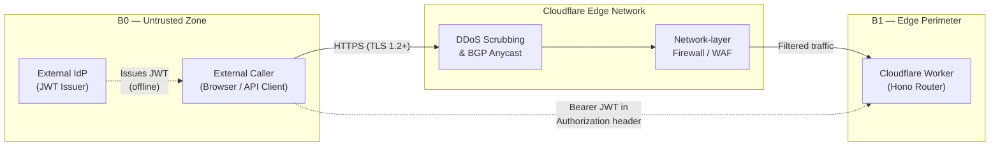
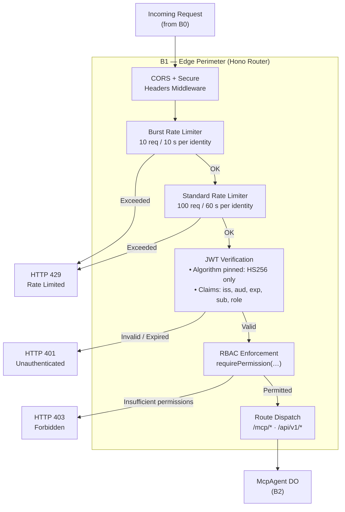
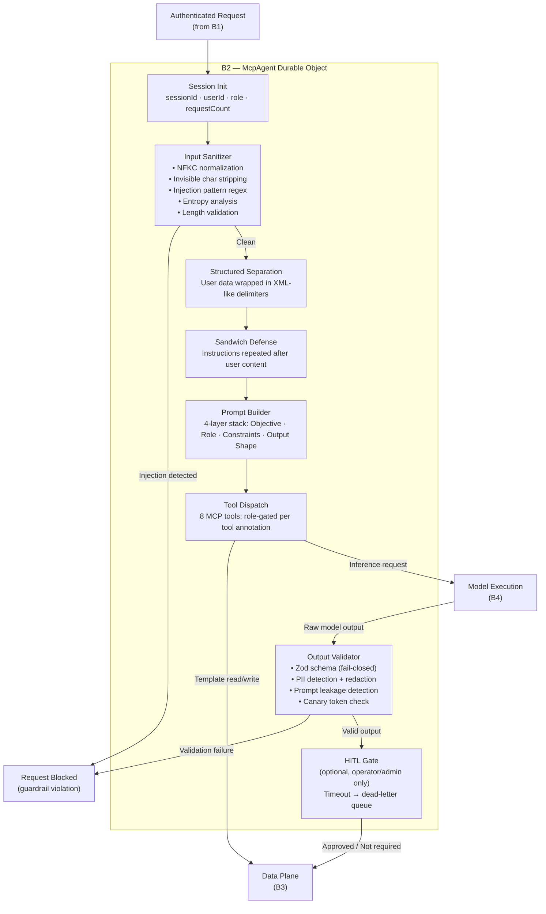
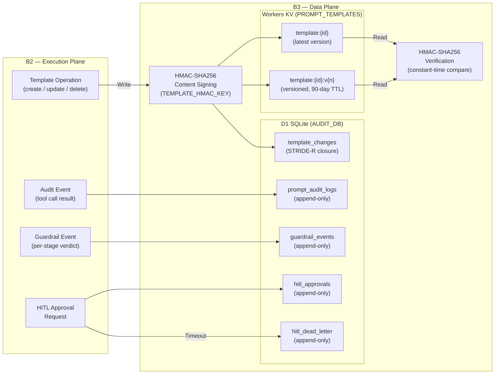
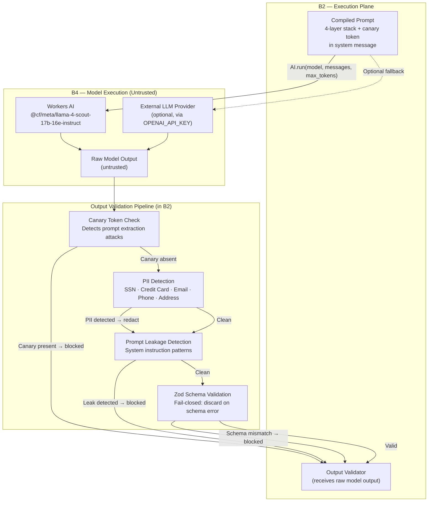

# STRIDE Threat Model — promptcrafting-mcp

This document provides formal Data Flow Diagrams (DFDs) and STRIDE threat mappings for each
of the five named security boundaries in the promptcrafting-mcp architecture.  Every
implemented control is traced to the STRIDE category it mitigates.  Residual risks with no
current mitigation are listed explicitly in the final section.

---

## Architecture Overview

```
┌──────────────────────────────────────────────────────────────────┐
│  B0: Untrusted Zone                                              │
│  External callers, Admin UIs, External Identity Providers        │
└───────────────────────────┬──────────────────────────────────────┘
                            │ HTTPS / TLS 1.2+
┌───────────────────────────▼──────────────────────────────────────┐
│  B1: Edge Perimeter (Hono Router on Cloudflare Worker)           │
│  CORS → Rate Limiter → JWT Auth → RBAC → Route Dispatch          │
└───────────────────────────┬──────────────────────────────────────┘
                            │ Authenticated, rate-limited, RBAC-checked
┌───────────────────────────▼──────────────────────────────────────┐
│  B2: Controlled Execution Plane (McpAgent Durable Object)        │
│  Input Sanitizer → Structured Separation → Sandwich Defense      │
│  → Prompt Builder → Tool Dispatch → Output Validator → HITL Gate │
└───────────────────────────┬──────────────────────────────────────┘
                            │ HMAC-signed templates / append-only audit
┌───────────────────────────▼──────────────────────────────────────┐
│  B3: Data Plane                                                  │
│  Workers KV (HMAC-signed templates) + D1 SQLite (audit trail)    │
│  + HITL approvals                                                │
└───────────────────────────┬──────────────────────────────────────┘
                            │ Compiled prompt (untrusted zone)
┌───────────────────────────▼──────────────────────────────────────┐
│  B4: Model Execution (Untrusted)                                 │
│  Workers AI / External LLM Providers                             │
│  ⚠ All outputs treated as untrusted — validated back in B2       │
└──────────────────────────────────────────────────────────────────┘
```

---

## B0 — Public Internet

### Scope
Everything outside Cloudflare's network: web browsers, API clients, admin dashboards,
external Identity Providers.  This boundary has no authentication controls of its own;
its role is to establish TLS and deliver traffic to B1.

### Data Flow Diagram



### STRIDE Analysis

| STRIDE | Threat | Control | Status |
|--------|--------|---------|--------|
| **Spoofing** | Caller impersonates a legitimate user | JWT bearer token required at B1; unauthenticated requests rejected with HTTP 401 | ✅ |
| **Spoofing** | Client forges a JWT issued by a different IdP | Issuer claim (`iss`) pinned to `promptcrafting.net`; mismatches rejected | ✅ |
| **Tampering** | Wire-level request modification (MITM) | TLS 1.2+ enforced by Cloudflare; plaintext connections refused | ✅ |
| **Repudiation** | Caller denies making a request | JWT `sub` claim propagated to D1 audit log (B3) for every request | ✅ |
| **Information Disclosure** | Sensitive data exposed in transit | TLS encryption in transit; no secrets in URL parameters | ✅ |
| **Denial of Service** | Volumetric DDoS attack against the Worker | Cloudflare BGP anycast absorbs volumetric attacks before reaching B1 | ✅ |
| **Elevation of Privilege** | Unauthenticated caller accesses privileged endpoints | All `/mcp/*` and `/api/v1` routes require valid JWT + RBAC check (enforced in B1) | ✅ |

---

## B1 — Hono Router (Edge Perimeter)

### Scope
The Cloudflare Worker running the Hono HTTP router.  This is the first programmable layer
that handles authenticated request dispatch.  It enforces CORS, rate limiting, JWT
verification, and RBAC before any business logic executes.

### Data Flow Diagram



### STRIDE Analysis

| STRIDE | Threat | Control | Status |
|--------|--------|---------|--------|
| **Spoofing** | JWT algorithm confusion attack (`alg: none` or RS256 with HMAC key) | Header `alg` field pinned to `HS256`; any other value causes immediate rejection (`src/middleware/auth.ts`) | ✅ |
| **Spoofing** | Forged or replayed JWT | Expiry (`exp`) enforced; issuer (`iss`) and audience (`aud`) claims validated on every request | ✅ |
| **Spoofing** | Missing identity claims | `sub` and `role` claims required; absence causes HTTP 401 | ✅ |
| **Tampering** | Modified JWT payload | HMAC-SHA256 signature verified via Web Crypto API; any byte change invalidates signature | ✅ |
| **Repudiation** | User denies performing an action | `sub` (user ID) extracted from verified JWT and stored in Hono context; propagated to B3 audit log | ✅ |
| **Information Disclosure** | JWT secret leaked in error messages | Errors return generic messages; `JWT_SECRET` sourced from Workers Secrets, never hardcoded | ✅ |
| **Denial of Service** | Request flood from single identity | Identity-keyed rate limiting: 100 req/60 s (`RATE_LIMITER`) + 10 req/10 s (`BURST_LIMITER`); falls back to `CF-Connecting-IP` if unauthenticated | ✅ |
| **Denial of Service** | Slow-loris / connection exhaustion | Cloudflare edge terminates connections; Workers runtime enforces CPU time limits | ✅ |
| **Elevation of Privilege** | Low-privilege role accessing admin operations | `requirePermission()` guard on every route; `ROLE_PERMISSIONS` map enforces `admin` / `operator` / `viewer` separation | ✅ |
| **Elevation of Privilege** | Forged role claim in JWT | `role` claim validated against `ROLE_PERMISSIONS` enum; unknown roles rejected | ✅ |

---

## B2 — McpAgent Durable Object (Execution Plane)

### Scope
The `PromptMCPServer` Cloudflare Durable Object that executes MCP tool calls.  It owns the
complete input-sanitisation → prompt-compilation → model-invocation → output-validation
pipeline, plus the optional Human-In-The-Loop (HITL) gate.

### Data Flow Diagram



### STRIDE Analysis

| STRIDE | Threat | Control | Status |
|--------|--------|---------|--------|
| **Spoofing** | Tool call impersonates a different user session | DO session state (`sessionId`, `userId`, `role`) initialised from verified JWT and immutable for the session lifetime | ✅ |
| **Tampering** | Direct prompt injection via user-controlled input | NFKC normalisation + 20+ injection-pattern regexes (`src/guardrails/input-sanitizer.ts`); fail-closed on detection | ✅ |
| **Tampering** | Indirect injection via structured data in tool arguments | Structured separation: user content wrapped in XML-like delimiters; sandwich defence repeats system instructions after user data | ✅ |
| **Tampering** | Unicode homoglyph / invisible-character smuggling | Invisible character ranges stripped (U+200B–U+200F, U+E0000–U+E007F, zero-width joiners, bidirectional overrides) | ✅ |
| **Tampering** | Base64 / hex-encoded payload bypassing text filters | Shannon entropy analysis detects anomalously high-entropy strings; encoding-attack patterns matched by regex | ✅ |
| **Repudiation** | User denies executing a particular tool | `trackToolCall()` writes to DO SQLite `session_history`; `writeAuditLog()` writes to D1 at B3 | ✅ |
| **Information Disclosure** | Model extracts system prompt via adversarial input | Prompt leakage detector checks output for `## ROLE`, `## OBJECTIVE`, `## CONSTRAINTS` patterns before delivery | ✅ |
| **Information Disclosure** | PII in model output delivered to caller | Regex-based PII detection (SSN, credit card, email, phone, address); matched spans replaced with `[REDACTED:type]` | ✅ |
| **Denial of Service** | HITL approval queue grows unbounded, starving resources | Dead-letter queue for timed-out HITL requests; configurable `HITL_TIMEOUT_MS` (implementation pending — see Residual Risks) | 🔲 |
| **Elevation of Privilege** | Low-privilege caller invokes destructive MCP tool | Tool annotations (`destructive`, `write`) checked against caller's RBAC role before dispatch | ✅ |
| **Elevation of Privilege** | Adversarial prompt tricks model into granting itself admin actions | Output validator is fail-closed: if schema validation fails the response is discarded, not passed through | ✅ |

---

## B3 — KV + D1 (Data Plane)

### Scope
Workers KV for HMAC-signed prompt template storage (with versioned history) and D1 SQLite
for the append-only audit trail.  This boundary owns data integrity and non-repudiation.

### Data Flow Diagram



### STRIDE Analysis

| STRIDE | Threat | Control | Status |
|--------|--------|---------|--------|
| **Spoofing** | Attacker writes a template to KV pretending to be a legitimate creator | Writes require `template:write` permission (enforced in B1/B2); `TEMPLATE_HMAC_KEY` stored in Workers Secrets | ✅ |
| **Tampering** | Template content modified in KV after write | HMAC-SHA256 signature computed on content at write time; verified at read time with constant-time comparison (`src/services/prompt-builder.ts`) | ✅ |
| **Tampering** | Audit log records modified after insertion | D1 tables are append-only; no `UPDATE` or `DELETE` operations are issued by application code | ✅ |
| **Repudiation** | Creator denies creating or modifying a template | `template_changes` table records every create/update/delete with `user_id`, `action`, and `template_id` | ✅ |
| **Repudiation** | User denies executing a prompt | `prompt_audit_logs` records `request_id`, `session_id`, `user_id`, `model`, `status`, `latency_ms`, guardrail flags | ✅ |
| **Information Disclosure** | Raw prompt content leaked from audit logs | Only prompt hashes (SHA-256) are stored in audit logs, not raw prompt text (GDPR consideration) | ✅ |
| **Information Disclosure** | `TEMPLATE_HMAC_KEY` or `JWT_SECRET` leaked from environment | Secrets stored in Cloudflare Workers Secrets (encrypted at rest); never appear in code or logs | ✅ |
| **Denial of Service** | KV namespace flooded with junk templates | `template:write` permission required; rate limiting at B1 limits write throughput per identity | ✅ |
| **Denial of Service** | D1 disk exhaustion via audit log spam | Rate limiting at B1 bounds per-identity request rate; D1 quotas enforced by Cloudflare platform | ✅ |
| **Elevation of Privilege** | Read-only role reads another user's private templates | Templates keyed by ID; RBAC `template:read` permission required; no per-user namespace isolation beyond permissions | ✅ |

---

## B4 — Workers AI (Model Execution)

### Scope
Inference execution by Workers AI (default: `@cf/meta/llama-4-scout-17b-16e-instruct`) or
an optional external provider (OpenAI, via `OPENAI_API_KEY`).  The model is an untrusted
component; all its outputs are validated before use.

### Data Flow Diagram



### STRIDE Analysis

| STRIDE | Threat | Control | Status |
|--------|--------|---------|--------|
| **Spoofing** | Model output impersonates authoritative system response | Output validator is positioned in B2; model cannot directly write to audit log or KV | ✅ |
| **Tampering** | Adversarial model output causes downstream code to behave unexpectedly | Zod schema validation is fail-closed: any schema mismatch discards the output entirely | ✅ |
| **Tampering** | Model output integrity compromised in transit (Worker ↔ Workers AI) | Traffic stays within Cloudflare's internal network (same-PoP routing); TLS cert pinning not yet implemented (see Residual Risks) | 🔲 |
| **Repudiation** | Model denies generating a particular output | Token counts (`input_tokens`, `output_tokens`) and model identifier stored in `prompt_audit_logs` (B3) | ✅ |
| **Information Disclosure** | System prompt extracted by adversarial user input | Canary token embedded in system message; if token appears in output, request is blocked and alert logged | ✅ |
| **Information Disclosure** | PII from user data reflected in model output | Regex PII detector scans all model outputs; matched spans replaced with `[REDACTED:type]` before delivery | ✅ |
| **Information Disclosure** | System instructions echoed in model output | Leakage detector checks output for `## ROLE`, `## OBJECTIVE`, `## CONSTRAINTS`, `## OUTPUT FORMAT` sections | ✅ |
| **Denial of Service** | Model generates excessively long output consuming downstream resources | `max_tokens` cap enforced on every `AI.run()` call | ✅ |
| **Denial of Service** | Slow model response blocks DO execution | Workers CPU time limits enforce overall deadline; HITL gate not directly related but timeout protects approval queue | ✅ |
| **Elevation of Privilege** | Model output contains instructions that escalate caller privileges | Output validator discards non-conforming output; model has no path to modify JWT claims or RBAC state | ✅ |

---

## Cross-Boundary STRIDE Summary

| STRIDE Category | B0 | B1 | B2 | B3 | B4 |
|-----------------|----|----|----|----|-----|
| **Spoofing** | TLS; JWT required at B1 | Algorithm pinning; claim validation (`iss`, `aud`, `exp`, `sub`, `role`) | Session state from verified JWT; immutable per DO lifetime | HMAC key in Secrets; write permission required | Model output isolated from auth plane |
| **Tampering** | TLS prevents MITM | HMAC signature verification on JWT | NFKC normalisation; injection patterns; entropy; invisible char stripping | HMAC-SHA256 on templates; append-only D1 | Zod fail-closed validation; canary tokens |
| **Repudiation** | JWT `sub` propagated to audit | `sub` extracted and stored in Hono context | `trackToolCall()` in DO SQLite; `writeAuditLog()` to D1 | Append-only `prompt_audit_logs`, `template_changes` | Token counts + model ID in audit log |
| **Information Disclosure** | TLS in transit | Generic error messages; `JWT_SECRET` in Secrets | PII redaction; leakage detection before delivery | Prompt hashes only (no raw text); Secrets encrypted at rest | Canary check; PII redaction; leakage detection |
| **Denial of Service** | Cloudflare BGP/DDoS scrubbing | Identity-keyed rate limiting (100/60 s + 10/10 s) | HITL timeout + dead-letter (partial — see below) | Rate limiting bounds write throughput; D1/KV platform SLA | `max_tokens` cap; Workers CPU deadline |
| **Elevation of Privilege** | Unauthenticated → HTTP 401 | RBAC `requirePermission()` per route; invalid roles rejected | Tool annotations gated by role; fail-closed output validator | Write ops require explicit permission | Model cannot modify JWT/RBAC state |

---

## Residual Risks

The following threats have **no current mitigation** or only a planned (unimplemented) control.

| ID | Boundary | STRIDE | Threat Description | Planned Mitigation | Tracking |
|----|----------|--------|-------------------|--------------------|---------|
| RR-01 | B2 | **DoS** | HITL approval queue can grow unbounded if approvals time out faster than the dead-letter queue is drained, potentially consuming DO storage | Configurable `HITL_TIMEOUT_MS` with enforced eviction (listed as 🔲 in README) | `src/services/hitl.ts` — timeout not yet wired |
| RR-02 | B4 | **Tampering** | No TLS certificate pinning between the Worker and external LLM providers (OpenAI fallback path); a MITM on Cloudflare's egress network could substitute model responses | Certificate pinning for external provider HTTPS calls | README: `Response integrity — TLS cert pinning (planned)` |
| RR-03 | B2 | **Information Disclosure** | PII detection is regex-only (no NER); structured or obfuscated PII (e.g., spaced SSNs, leetspeak emails) may bypass redaction | Integrate Presidio / LLM Guard for semantic PII detection | README: `Cloudflare Firewall for AI integration (semantic input/output scanning)` |
| RR-04 | B0→B1 | **DoS** | Unauthenticated requests (before JWT verification) fall back to `CF-Connecting-IP` for rate limiting; IPv6 rotation or shared NAT egress may allow bypass | Require at minimum a valid (but unpermissioned) JWT before rate-limit key assignment, or use Cloudflare mTLS at the edge | None tracked |
| RR-05 | B3 | **Information Disclosure** | No per-user namespace isolation in Workers KV; any holder of a valid `template:read` JWT can enumerate all templates, regardless of creator | Template-level ACL stored in D1 and enforced at read time | None tracked |
| RR-06 | B3 | **Information Disclosure** | Audit log export (`audit:export` permission) is not yet implemented; compliance reporting relies on direct D1 query access | Implement `promptcraft_export_audit` tool with scoped export permissions | README: Next Steps |
| RR-07 | B2 | **Repudiation** | `trackToolCall()` must be called explicitly by each tool implementation; missing invocation in a new tool would create an audit gap | Enforce `trackToolCall()` in a DO middleware layer rather than relying on per-tool calls | `src/mcp-agent.ts` |
| RR-08 | B4 | **Spoofing** | Workers AI binding does not expose the model's cryptographic identity; the application cannot verify it is talking to the declared model (model substitution by platform) | Rely on Cloudflare's platform security guarantee; no application-level control available | Platform limitation |

---

## Document Metadata

| Field | Value |
|-------|-------|
| **Version** | 0.1.0 |
| **Boundary coverage** | B0, B1, B2, B3, B4 |
| **STRIDE categories mapped** | All 6 (S, T, R, I, D, E) |
| **Implemented controls** | 34 |
| **Residual risks documented** | 8 (RR-01 – RR-08) |
| **Diagram format** | Mermaid (GitHub-renderable) |
| **Source references** | `src/middleware/auth.ts`, `src/guardrails/input-sanitizer.ts`, `src/guardrails/output-validator.ts`, `src/services/audit.ts`, `src/services/prompt-builder.ts`, `src/services/hitl.ts`, `src/mcp-agent.ts`, `src/index.ts` |
